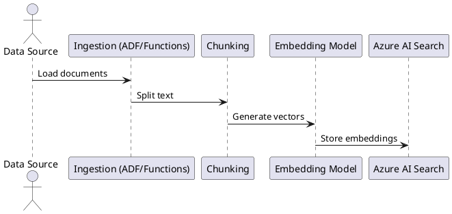
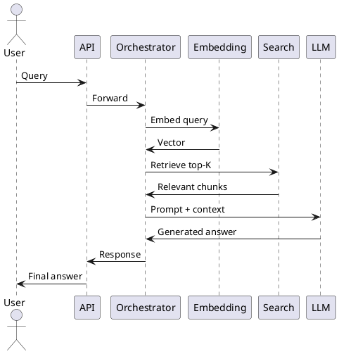

Below is a **production-ready Azure RAG architecture** delivered as:

✅ C4 diagrams (PlantUML)  
✅ aligned with your current page (RAG flow)  
✅ aligned with enterprise deployment patterns

***

# 🧩 1. C4 Level 1 – System Context

```plantuml
@startuml
!include https://raw.githubusercontent.com/plantuml-stdlib/C4-PlantUML/master/C4_Context.puml

Person(user, "User", "Uses RAG-powered application")

System(ragSystem, "RAG System", "Retrieval Augmented Generation Application")

System_Ext(dataSources, "Enterprise Data Sources", "Blob, SharePoint, DB")
System_Ext(llm, "LLM (Claude / Azure OpenAI)", "Generative model")

user -> ragSystem : Ask question
ragSystem -> dataSources : Retrieve indexed data
ragSystem -> llm : Send prompt + context
llm -> ragSystem : Generated response
ragSystem -> user : Answer

@enduml
```

***

# 🏗️ 2. C4 Level 2 – Container Diagram (Core Azure Architecture)

```plantuml
@startuml
!include https://raw.githubusercontent.com/plantuml-stdlib/C4-PlantUML/master/C4_Container.puml

Person(user, "User")

System_Boundary(system, "RAG Platform") {

    Container(ui, "Web UI", "React / Web App", "Chat interface")

    Container(api, "API Layer", "App Service / AKS", "Handles requests")

    Container(orchestrator, "Orchestrator", "Semantic Kernel / LangGraph",
    "Manages RAG flow, prompt assembly")

    Container(search, "Azure AI Search", "Vector DB",
    "Stores embeddings, performs retrieval")

    Container(llm, "LLM", "Claude / Azure OpenAI",
    "Generates answers")

    Container(cache, "Cache", "Redis",
    "Stores query + response")

}

System_Ext(storage, "Data Sources", "Blob / Cosmos DB")

Rel(user, ui, "Interacts with")
Rel(ui, api, "API calls")
Rel(api, orchestrator, "Forward request")

Rel(orchestrator, search, "Query embeddings / retrieve docs")
Rel(orchestrator, llm, "Send prompt with context")

Rel(search, storage, "Indexed from")
Rel(api, cache, "Check/store cache")

Rel(llm, orchestrator, "Return response")
Rel(orchestrator, api, "Return result")
Rel(api, ui, "Return response")

@enduml
```

***

# ⚙️ 3. C4 Level 3 – Component Diagram (Detailed RAG Flow)

```plantuml
@startuml
!include https://raw.githubusercontent.com/plantuml-stdlib/C4-PlantUML/master/C4_Component.puml

Container(orchestrator, "Orchestrator", "LangGraph / SK") {

    Component(queryProcessor, "Query Processor",
    "Handles user query")

    Component(embedder, "Embedding Service",
    "Azure OpenAI / Voyage")

    Component(retriever, "Retriever",
    "Vector + Hybrid search")

    Component(promptBuilder, "Prompt Builder",
    "Construct final prompt")

    Component(generator, "LLM Caller",
    "Claude API / Azure OpenAI")

}

Rel(queryProcessor, embedder, "Convert query → vector")
Rel(embedder, retriever, "Search similar embeddings")
Rel(retriever, promptBuilder, "Return top-K chunks")
Rel(promptBuilder, generator, "Create prompt with context")

@enduml
```

***

# 🔄 4. Data Pipeline (Offline Flow)



***

# 🧠 5. Full Runtime Sequence (Exact Mapping to Page)



***

# ⚖️ 6. Architecture Decisions (Important for Your Role)

## 6.1 Retrieval Strategy

| Option        | Recommendation   |
| ------------- | ---------------- |
| Vector only   | ❌ Not enough     |
| Keyword only  | ❌ Limited        |
| Hybrid search | ✅ Default choice |
| Reranking     | ✅ For production |

***

## 6.2 Orchestrator Choice

| Option          | When to use       |
| --------------- | ----------------- |
| Semantic Kernel | Azure-native      |
| LangChain       | Simple app        |
| LangGraph       | ✅ Agent-level RAG |

***

## 6.3 Deployment Strategy

| Layer         | Azure Service     |
| ------------- | ----------------- |
| UI            | Static Web App    |
| API           | App Service / AKS |
| Orchestration | Container         |
| RAG Storage   | Azure AI Search   |
| Data          | Blob / Cosmos     |

***

# 🚀 7. Production Enhancements

## 7.1 Must-have

* ✅ Caching (Redis)
* ✅ Monitoring (App Insights)
* ✅ Prompt versioning
* ✅ Retry + timeout

## 7.2 Advanced (Enterprise)

* ✅ Multi-index RAG
* ✅ Agentic retrieval (LangGraph)
* ✅ Feedback loop → eval system
* ✅ Security trimming (RBAC)

***

# ✅ 8. Key Takeaways

* Your current page = **Level 3 logic (core RAG flow)**
* Azure architecture = **multi-layer system around it**
* Critical success factors:

```
Retrieval quality > Model quality
```

* Best enterprise stack (aligned with your profile):

```
Azure AI Search
+ LangGraph orchestrator
+ Claude / Azure OpenAI
+ App Service / AKS
+ Redis + Monitoring
```

***

# 🔗 References

* [Azure RAG architecture design guide](https://learn.microsoft.com/en-us/azure/architecture/ai-ml/guide/rag/rag-solution-design-and-evaluation-guide) [\[intelliarts.com\]](https://intelliarts.com/blog/enterprise-rag-system-best-practices/)
* [Azure AI Search RAG overview](https://learn.microsoft.com/en-us/azure/search/retrieval-augmented-generation-overview) [\[docs.azure.cn\]](https://docs.azure.cn/en-us/search/tutorial-rag-build-solution)
* [Vector search in Azure AI Search](https://learn.microsoft.com/en-us/azure/search/vector-search-overview) [\[github.com\]](https://github.com/MicrosoftDocs/azure-ai-docs/blob/main/articles/search/vector-search-how-to-generate-embeddings.md)

***


