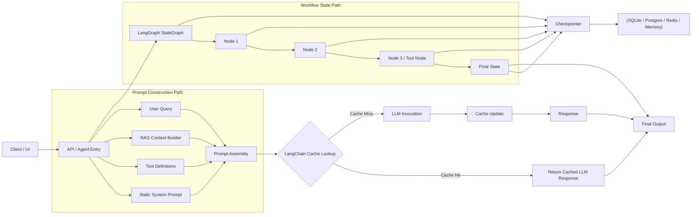

## LangChain / LangGraph equivalent to Claude prompt caching

### 1) What is equivalent — and what is **not** 1:1

The current page Rules of prompt caching explains **prefix/prompt caching**: computation is explicitly cached for content **up to a breakpoint**, and reuse only happens when the content up to that breakpoint is identical. The page also states cache reuse is sensitive to any changes in that cached prefix. [\[Rules of p...pt caching\]](https://anthropic.skilljar.com/claude-with-the-anthropic-api/287770)

In the LangChain / LangGraph ecosystem, the closest practical equivalents are:

* **LangChain LLM response caching** for repeated model calls, with exact-match or semantic cache backends. The official docs describe cache integrations for individual LLM calls and mention multiple cache strategies. [\[docs.langchain.com\]](https://docs.langchain.com/oss/javascript/integrations/llm_caching), [\[docs.langchain.com\]](https://docs.langchain.com/oss/python/integrations/providers/redis)
* **LangGraph persistence / checkpointing** for saving graph state at each step. The official docs state that a checkpointer saves graph state as checkpoints, organized into threads, enabling conversational memory and fault tolerance. [\[docs.langchain.com\]](https://docs.langchain.com/oss/python/langgraph/persistence), [\[langchain-....github.io\]](https://langchain-ai.github.io/langgraphjs/reference/modules/langgraph-checkpoint.html)

**Important distinction:**\
Claude prompt caching caches **prefix computation inside a request structure**; LangChain standard caching usually caches the **output of an LLM invocation**; LangGraph persistence stores **workflow state**, not raw prompt-prefix compute. This is an architectural equivalent for cost/performance optimization, not a feature-identical replica. 

***

## 2) Recommended mapping

### A. Static prompt prefix / repeated instructions

Use **LangChain exact-match LLM cache**.

Suitable for:

* stable system instructions
* repeated tool descriptions
* repeated RAG context assembly when the final prompt becomes identical

The official docs and examples show exact LLM caching with in-memory, SQLite, and Redis-based integrations. 

### B. Slightly varied but semantically similar prompts

Use **semantic cache** (for example Redis-based semantic caching).

Relevant for:

* repeated paraphrased questions
* frequently repeated business queries with small wording changes

Redis integration documentation explicitly calls out semantic caching, and RedisSemanticCache documentation describes vector-similarity-based retrieval for semantically similar prompts. 

### C. Multi-step agent / workflow execution

Use **LangGraph checkpointers**.

Relevant for:

* multi-turn conversations
* human-in-the-loop approval flows
* agent restart / resume
* long-running workflows

The persistence documentation states that LangGraph saves graph state as checkpoints and associates them with `thread_id`. 
***

# 3) Architecture diagram — LangChain cache + LangGraph checkpointing

## 3.1 Combined architecture (Mermaid)


### Interpretation

* **Prompt-path optimization** = LangChain cache lookup before the model call.
* **Workflow/path-state optimization** = LangGraph checkpointing after each graph step.\
  This reflects the official descriptions of LLM cache integrations and graph persistence. 

***

# 4) Suggested implementation — LangChain exact-match cache

> **Suggested implementation (example code)**\
> The code below is an implementation pattern derived from the documented caching concepts, adapted into a practical Python example.

```python
# pip install -U langchain langchain-openai langchain-community

from langchain_core.globals import set_llm_cache
from langchain_community.cache import SQLiteCache
from langchain_openai import ChatOpenAI
from langchain_core.prompts import ChatPromptTemplate

# 1) Exact-match LLM cache
set_llm_cache(SQLiteCache(database_path=".langchain_cache.db"))

# 2) Stable prompt prefix
SYSTEM_PROMPT = """
You are an enterprise solution architect assistant.
Use the provided architecture principles, security constraints,
and service selection rules to answer precisely.
"""

RAG_CONTEXT = """
Architecture principles:
- Use private networking where possible
- Prefer managed identity for service auth
- Keep application and vector retrieval loosely coupled
"""

prompt = ChatPromptTemplate.from_messages([
    ("system", SYSTEM_PROMPT),
    ("human", "Context:\n{context}\n\nQuestion:\n{question}")
])

llm = ChatOpenAI(model="gpt-4o-mini", temperature=0)

chain = prompt | llm

# 3) First call -> cache miss
resp1 = chain.invoke({
    "context": RAG_CONTEXT,
    "question": "Explain the recommended architecture."
})

# 4) Same call -> cache hit
resp2 = chain.invoke({
    "context": RAG_CONTEXT,
    "question": "Explain the recommended architecture."
})

print(resp1.content)
print(resp2.content)
```

### How this maps to Claude prompt caching

* `SYSTEM_PROMPT` + repeated `context` represent the **stable prefix**.
* When the final serialized model request is identical, the cache can be reused.
* Unlike Claude’s explicit breakpoint model, this is usually **request-level caching by call identity**, not explicit prefix-boundary caching. [\[Rules of p...pt caching\]](https://anthropic.skilljar.com/claude-with-the-anthropic-api/287770), [\[langchain-...thedocs.io\]](https://langchain-doc.readthedocs.io/en/latest/modules/llms/examples/llm_caching.html), [\[docs.langchain.com\]](https://docs.langchain.com/oss/javascript/integrations/llm_caching)

***

# 5) Suggested implementation — LangChain semantic cache

> **Suggested implementation (example code)**\
> Suitable when repeated prompts are not textually identical.

```python
# pip install -U langchain langchain-openai langchain-redis redis

from langchain_core.globals import set_llm_cache
from langchain_openai import ChatOpenAI, OpenAIEmbeddings
from langchain_redis import RedisSemanticCache

embeddings = OpenAIEmbeddings()

semantic_cache = RedisSemanticCache(
    embeddings=embeddings,
    redis_url="redis://localhost:6379",
    distance_threshold=0.2,
)

set_llm_cache(semantic_cache)

llm = ChatOpenAI(model="gpt-4o-mini", temperature=0)

q1 = "Summarize the architecture risks for the agent platform."
q2 = "Provide a summary of the main risks in the agent platform architecture."

r1 = llm.invoke(q1)
r2 = llm.invoke(q2)

print(r1.content)
print(r2.content)
```

The semantic cache concept is supported by Redis integration and RedisSemanticCache documentation, which describe vector-similarity-based cache lookup instead of only exact string match. [\[redis.io\]](https://redis.io/docs/latest/integrate/langchain-redis/), [\[deepwiki.com\]](https://deepwiki.com/langchain-ai/langchain-redis/3.2-semantic-caching-with-redissemanticcache)

***

# 6) Suggested implementation — LangGraph checkpointed workflow

> **Suggested implementation (example code)**\
> This implements the stateful equivalent of “reusing prior expensive work,” but at workflow-state level.

```python
# pip install -U langgraph langchain langchain-openai

from typing import TypedDict, List
from langgraph.graph import StateGraph, START, END
from langgraph.checkpoint.memory import MemorySaver
from langchain_openai import ChatOpenAI

class AgentState(TypedDict):
    messages: List[str]
    retrieved_context: str
    answer: str

llm = ChatOpenAI(model="gpt-4o-mini", temperature=0)

def retrieve_context(state: AgentState) -> AgentState:
    # Placeholder retrieval step
    state["retrieved_context"] = """
    Enterprise principles:
    - RBAC
    - Managed Identity
    - Private Endpoints
    """
    return state

def answer_question(state: AgentState) -> AgentState:
    user_question = state["messages"][-1]
    prompt = f"""
    Context:
    {state['retrieved_context']}

    Question:
    {user_question}
    """
    response = llm.invoke(prompt)
    state["answer"] = response.content
    return state

graph_builder = StateGraph(AgentState)
graph_builder.add_node("retrieve_context", retrieve_context)
graph_builder.add_node("answer_question", answer_question)

graph_builder.add_edge(START, "retrieve_context")
graph_builder.add_edge("retrieve_context", "answer_question")
graph_builder.add_edge("answer_question", END)

checkpointer = MemorySaver()
graph = graph_builder.compile(checkpointer=checkpointer)

config = {"configurable": {"thread_id": "arch-session-001"}}

# First run
result1 = graph.invoke(
    {"messages": ["Explain the solution architecture."],
     "retrieved_context": "",
     "answer": ""},
    config=config
)

# Follow-up run in same thread
result2 = graph.invoke(
    {"messages": ["Now list the security controls."],
     "retrieved_context": "",
     "answer": ""},
    config=config
)

print(result1["answer"])
print(result2["answer"])
```

The official persistence docs state that when a graph is compiled with a checkpointer, state snapshots are saved during execution and tied to a `thread_id`, enabling memory and resume behavior. [\[docs.langchain.com\]](https://docs.langchain.com/oss/python/langgraph/persistence), [\[langchain-....github.io\]](https://langchain-ai.github.io/langgraphjs/reference/modules/langgraph-checkpoint.html)

***

# 7) LangGraph checkpointing diagram


This matches the documented checkpointing model where graph state is persisted across execution steps and associated with threads.

***

# 8) Recommended enterprise strategy


## Recommended split

### Option 1 — Simple chat / RAG API

* **LangChain exact cache** for repeated calls
* SQLite for local/dev
* Redis for shared environments

### Option 2 — Enterprise agent workflow

* **LangChain cache** for repeated sub-prompts
* **LangGraph checkpointing** for workflow continuity
* Postgres or durable backend for production checkpoint store

### Option 3 — Best for large enterprise assistants

* Exact cache for deterministic repeated prompts
* Semantic cache for paraphrase-heavy traffic
* LangGraph checkpointer for stateful agent runs
* Separate retrieval cache for embeddings / vector search results

***

# 9) Practical design notes

### Use exact cache when:

* prompts are highly stable
* prompt templates are deterministic
* the same context bundle is sent repeatedly

### Use semantic cache when:

* users paraphrase the same request
* FAQ-style workloads dominate

### Use LangGraph checkpointers when:

* the workflow has multiple nodes/tools
* interruption/resume matters
* auditability of state transitions matters

***

# 10) Short answer

**Claude prompt caching equivalent in LangChain / LangGraph is usually implemented as:**

1. **LangChain cache** for repeated LLM calls
2. **LangGraph checkpointing** for persisted multi-step workflow state

This is the closest architecture-level equivalent, but not a one-to-one feature clone of Claude’s explicit cache-breakpoint prefix caching. 
***

## References

* Rules of prompt caching course page (open page content) [\[Rules of p...pt caching\]](https://anthropic.skilljar.com/claude-with-the-anthropic-api/287770)
* [LangChain cache integrations](https://docs.langchain.com/oss/javascript/integrations/llm_caching) [\[docs.langchain.com\]](https://docs.langchain.com/oss/javascript/integrations/llm_caching)
* [LangGraph persistence](https://docs.langchain.com/oss/python/langgraph/persistence) [\[docs.langchain.com\]](https://docs.langchain.com/oss/python/langgraph/persistence)
* [Redis provider integrations for LangChain](https://docs.langchain.com/oss/python/integrations/providers/redis) [\[docs.langchain.com\]](https://docs.langchain.com/oss/python/integrations/providers/redis)
* [Redis with LangChain overview](https://redis.io/docs/latest/integrate/langchain-redis/) [\[redis.io\]](https://redis.io/docs/latest/integrate/langchain-redis/)


