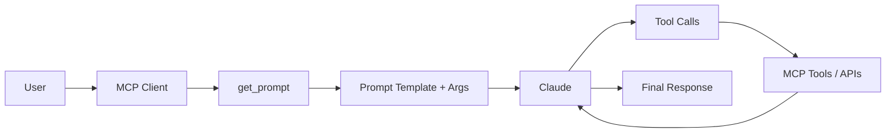

*Prompts in the client"
👉 [Prompts in the client](https://anthropic.skilljar.com/claude-with-the-anthropic-api/287786)

***

# 1. Summary (Page Content)

This page explains **how prompts are managed and used in an MCP (Model Context Protocol) client**.

### Key Concepts

* **Prompts in MCP**
  * Defined as a **set of user + assistant messages**
  * Stored on the **MCP server**
  * Retrieved and used by the **client**
  * Designed to be **reusable, parameterized templates**

***

### Core Implementation

#### 1. List available prompts

```python
async def list_prompts(self) -> list[types.Prompt]:
    result = await self.session().list_prompts()
    return result.prompts
```

* Calls MCP session API
* Returns all available prompts

***

#### 2. Get a specific prompt

```python
async def get_prompt(self, prompt_name, args: dict[str, str]):
    result = await self.session().get_prompt(prompt_name, args)
    return result.messages
```

* Retrieves a prompt by name
* Injects arguments dynamically
* Returns a **message sequence ready for Claude**

***

#### 3. Dynamic Prompt Arguments

* Prompts are defined as **functions on server**

```python
def format_document(doc_id: str):
    # doc_id is interpolated into the prompt
```

* Client call:

```python
get_prompt("format_document", {"doc_id": "123"})
```

* MCP server injects arguments → returns final messages

***

### Runtime Workflow

1. User selects a prompt (CLI `/command`)
2. System asks for required arguments
3. Prompt + arguments → sent to Claude
4. Claude may:
   * Use tools
   * Fetch data
   * Complete task

***

### Prompt Design Principles

* Relevant to MCP server purpose
* Clear and specific instructions
* Parameterized (argument-driven)
* Tested before deployment
* Designed to work with tools

***

### Core Idea

👉 Prompts act as:

* **Reusable templates**
* **Execution entry points**
* **Bridge between static logic and dynamic tasks**

***

# 2. Q\&A

### Q1. What is a prompt in MCP?

A structured set of **messages (user + assistant)** stored on the server and reused by the client.

***

### Q2. What does `list_prompts()` do?

Retrieves all available prompt definitions from the MCP server.

***

### Q3. What does `get_prompt()` return?

A **fully constructed message sequence** ready to be sent to Claude.

***

### Q4. Why are arguments used in prompts?

To **parameterize prompts**, enabling dynamic behavior (e.g. document ID, context).

***

### Q5. Where is prompt logic defined?

On the **MCP server (as functions)**.

***

### Q6. What is the role of CLI interaction?

* Select prompt
* Provide arguments
* Trigger execution

***

### Q7. How do prompts relate to tools?

Prompts can guide Claude to:

* Call tools
* Fetch external data
* Execute workflows

***

# 3. Quiz

### Basic

1. What does `get_prompt()` return?
   * A. Raw text
   * B. Message list ✅
   * C. JSON schema
   * D. API key

***

2. Where are prompts defined?
   * A. Client
   * B. Server ✅
   * C. UI
   * D. CLI only

***

3. Why use arguments in prompts?
   * A. Reduce latency
   * B. Add randomness
   * C. Enable dynamic content ✅
   * D. Improve streaming

***

### Intermediate

4. What happens when a prompt is selected in CLI?
   * Prompt arguments are requested → prompt executed ✅

***

5. What is the main purpose of prompts in MCP?
   * Provide reusable structured starting points ✅

***

### Advanced

6. Which architecture pattern is this closest to?
   * A. Hardcoded prompts
   * B. Template Engine / Function-based prompt system ✅
   * C. Pure RAG
   * D. Static pipelines

***

# 4. Key Takeaways

* MCP prompts = **server-defined reusable templates**
* `list_prompts` → discovery
* `get_prompt` → execution-ready messages
* Arguments enable **dynamic prompt composition**
* Prompts integrate tightly with:
  * tools
  * workflows
  * agents
* Acts as **interface layer between user intent and system capabilities**

***

# 5. Extensions (Important for your use case)

Based on your LangChain / LangGraph / MCP interest:

### Mapping Concept

| MCP Concept      | Equivalent               |
| ---------------- | ------------------------ |
| Prompt function  | LangChain PromptTemplate |
| get\_prompt()    | prompt.format()          |
| MCP server       | Tool/Agent registry      |
| Message sequence | ChatMessages             |
| Prompt + tools   | Agent execution plan     |

***

### Suggested Architecture Extension


***

# 6. References

* [Prompts in the client](https://anthropic.skilljar.com/claude-with-the-anthropic-api/287786)
* [Claude API Course Overview](https://anthropic.skilljar.com/claude-with-the-anthropic-api/287786)
* <https://github.com/phaledang/learn-claude/tree/main/03%20claude-with-the-anthropic-api>

